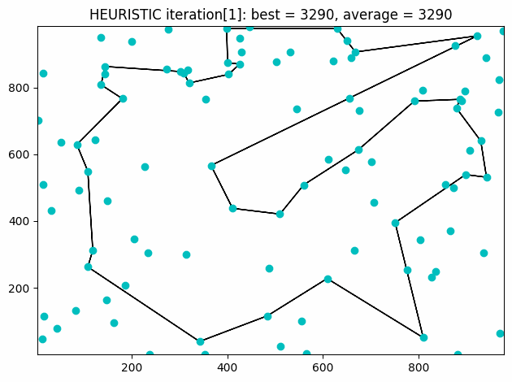
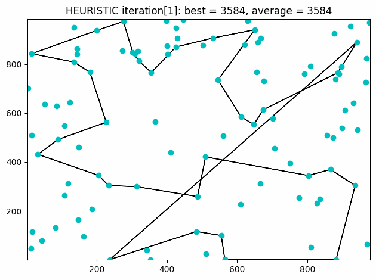

# Problème de métro circulaire

### Projet: http://www-desir.lip6.fr/~fouilhoux/MAOA/Files/Projet_MAOA_Metro_Circulaire.pdf

### Binôme:
Lou Moulin-Roussel 
Maxence Maire 

### Fonctionnement
Pour lancer l'algorithme, ouvrir le terminal, se placer dans le répertoire du code et lancer "python main.py".
S'assurer d'avoir installé toutes les librairies utilisées par le programme.

### Méthode Méta-Heuristique:
1. Choisir l'ensemble de villes où l'on va mettre des stations
2. Recherche locale:
- Voyageur de commerce rapide pour trouver l'ordre des stations
- Evaluation des solutions, et suppression des mauvaises solutions
- Changer une station pour chercher une nouvelle solution et génération de X nouvelles configurations pour l'itération suivante de la boucle
3. Voyageur de commerce poussé pour trouver une bonne solution

#### Exemples:
##### Fonctionnement correct (bons résultats):

##### Mauvais fonctionnement (bloqué sur maximum local):

### Méthode exacte (formulation compacte ou non-compacte)
1. Choisir l'ensemble de villes où l'on va mettre des stations
2. Voyageur de commerce exact pour trouver la meilleure solution

 
 

### Elements
- ALGO GENERAL
&ensp;Choix des villes 
&ensp;Itération  => uniquement pour la méta heuristique 
&ensp;&ensp;Voyageur de commerce 
&ensp;&ensp;Evaluation 
&ensp;&ensp;Changement d'une station 
&ensp;Voyageur de commerce 
- Visualisation des données + Comparaison des résultats
- Heuristique:
&ensp;évaluation d'une solution
- Méta heuristique cf Critères 
&ensp;algo de choix des stations => Heuristique randomisée répétée du problème du médian 
&ensp;algo de changement de station => cf Changement de station 
&ensp;voyageur de commerce heuristique => cf Heuristique du proche voisin 
&ensp;voyageur de commerce avancé => résolution exacte (Gurobi/CPlex)
- Formulation compact
- Formulation non-compacte
- Visualisation de chaque point à chaque itération pour la méta heuristique
- Mini-rapport + Analyse critique

TSP => projet Concorde 

PLNE -> TSP Généralisé avec P-median quelconque 
(ou Anneau Etoile) 

### Changement de station
On remplace une station par une de ses villes voisines qui n'est pas une station. 
Générer X (100?) nouvelles configurations à partir des paramètres suivants:
- meilleure station 20% des configurations
- pire station 20% des configurations
- stations aléatoire 60% des configurations

### Critères:
- Coût de construction du métro (nombre de stations et longueur des tronçons) (le nombre de stations est fixé)
- Temps de trajets moyen d'une ville à une autre
- Ration moyen entre marche à pied et trajet en métro 
L'évalutation d'une solution se fait en n².
 
 

### Formulations PLNE
- Formulation PLNE compacte => P-Median puis TSP Concorde
- Formulation PLNE non compacte => P-Median (cluster) puis TSP Généralisé

> PL Formulation non compacte = nombre exponentiel de contraintes et de variables
